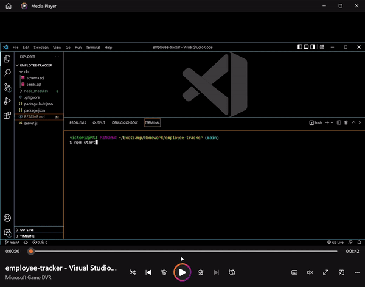

# employee-tracker

## Table of Contents
1. [Description](#description)
2. [Visuals](#visuals)
3. [Resources](#resources)

## Description

This project prompts the user to make a choice on what it wants the application to do. Once a choice is selected, they are either given a table of data or prompted to input information to add data.

For this project, I used schema.sql in the db folder to set up my data tables. I also included a seeds.sql to have starter data.

I used inquirer and mysql to make this program work.

## Visuals

## Resources

[Git Hub Repository](https://github.com/vmalie3/employee-tracker)

